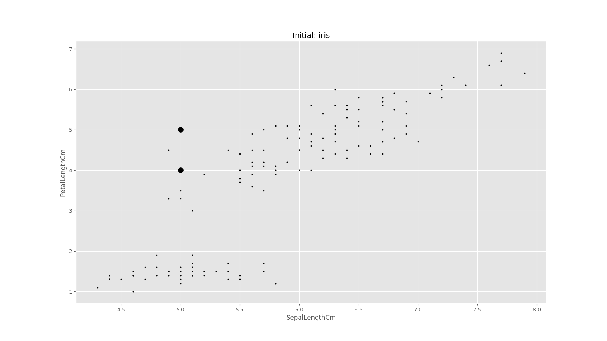
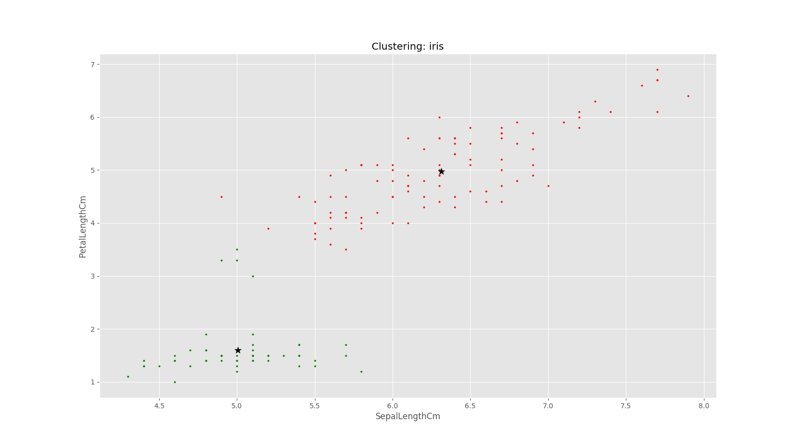
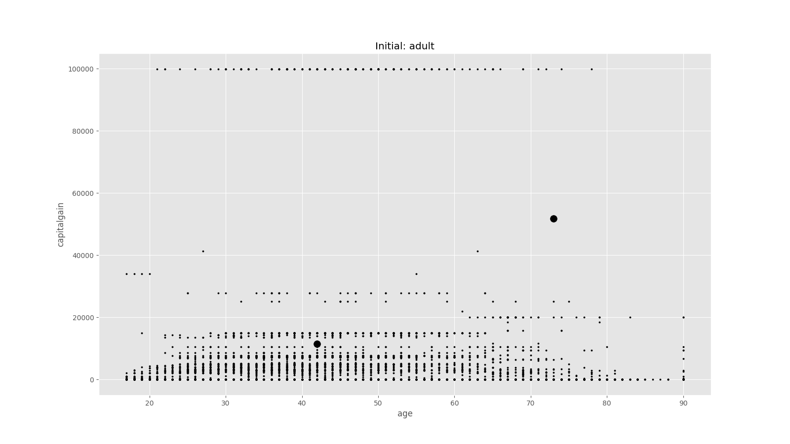
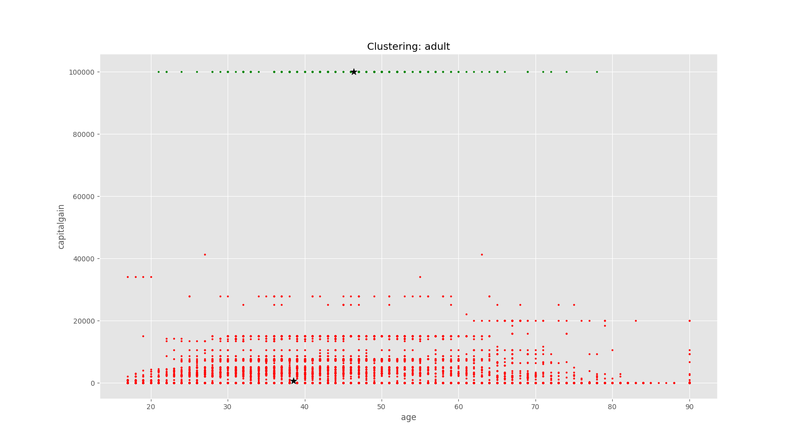

# Probably Interesting Data
*Gage Benne & Andy Monroe*

*EECS 738*

## Introduction
For our project, we attempted to analyze two different datasets, both by using the k-means clustering strategy in order to flesh out a wholistic understanding of k-means, how it works, and what it can demonstrate. We targeted relatively continuous datasets as much as possible, as clustering is typically more interesting on continuous-axis datapoints instead of highly-discrete datapoints represented in some of the datasets we examined.

The Iris dataset we used was very easy for applying k-means, as we could find a clean separation of one type of iris from the other two when comparing sepal width versus sepal length. This is a very standard dataset for demonstrating clustering of data, and our k-means implementation performed quite admirably in locating proper centroids for the two clusters.

The second dataset we used was census data plotting age versus capital gains. We were also able to effectively apply k-means here, however instead of demonstrating a particular relationship between age and capital gains, k-means demonstrates a clump of indivduals who reported exceptionally high capital gains. This group likely reached the maximum allowed by the census, which is how their cluster ended up being so close together.

By attempting to apply k-means to a nicely-clustered dataset, and a skew-clustered dataset, we have developed a profile of the k-means clustering strategy. The following sections provide the details and visuals for each dataset.

## Dataset 1: Iris
### Basic Idea
This is a very common example dataset for exemplifying k-means clustering, and we thought we would start off by making sure we could properly replicate the results of others. We compared sepal width versus sepal length for three species of iris plants, which, as it turns out, have two distinct width/ratios that are observable both to the human eye, and also to the k-means algorithm. The cluster to the left is the anomoly species, at least as opposed to the other two species which lie in the other cluster. 

Sepal Width vs. Sepal Length

## Dataset 2:
### Basic Idea
We thought it would be interesting to poke around in census data for our next statistical analysis. We initially had selected age versus capital gains, because we thought maybe there would be notable changes after a certain point in age, but what we ended up finding was a population of people of various ages that recorded substantially greater capital gains than the vast majority of the population. We were interested in trying out k-means to see how well it would capture a set of fewer datapoints that ended in a more one-dimensional cluster. As you can view yourself in the charts below, our k-means algorithm performed just as well the second time, and successfully separted the two clusters shown.

=
# K-Means Reference
[Reference](https://mubaris.com/posts/kmeans-clustering/)
