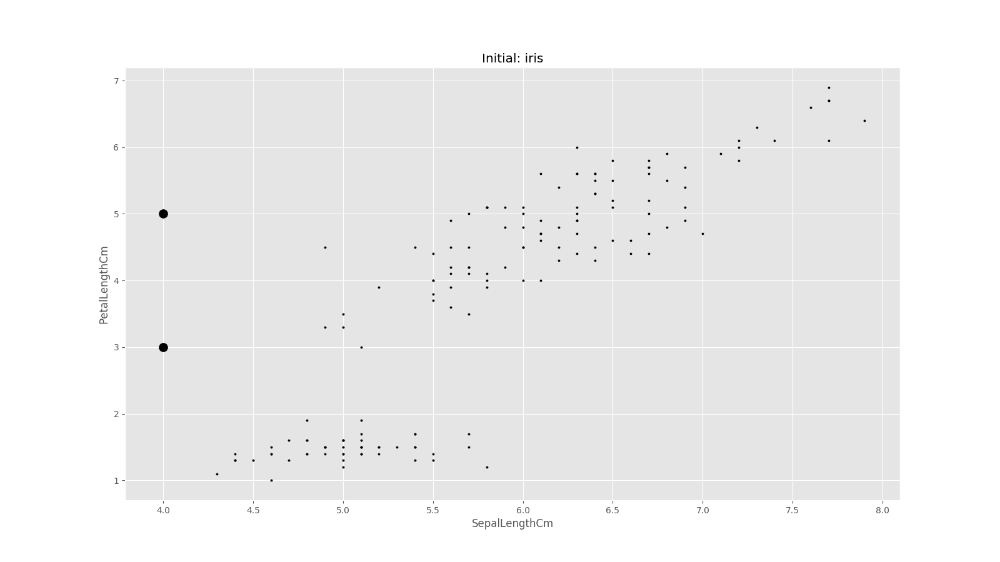

# Probably Interesting Data
*Gage Benne & Andy Monroe*

*EECS738*

## Introduction
For our project, we attempted to analyze two different datasets, both by using the k-means clustering strategy in order to flesh out a wholistic understanding of k-means, how it works, what it can do, and what it *can't* do.

The Iris dataset we used was very easy for applying k-means, as we could find a clean separation of one type of iris from the other two when comparing sepal width versus sepal length.

For the second dataset, we realized the shortcomings of the k-means clustering strategy. In particular, k-means just optimizes to get a roughly even amount of data-points as close to k centers as possible. This is fine for a set of roughly evenly-sized clusters, but some datasets have clusters of very different sizes. With k-means, the algorithm typically shows bias towards the largest cluster for all centroids, instead of placing a centroid in the smaller cluster, which is what we really would desire.

By attempting to apply k-means to a nicely-clustered dataset, and a skew-clustered dataset, we have developed a profile of the k-means clustering strategy, warts and all. The following sections provide the details and visuals for each dataset.

## Process
We opted to implement our k-means clustering strategy in Python so that we may utilize its many plotting and scientific computing packages, along with pandas.  We love pandas.  In getting started, we followed key points on a guide from [Mubaris NK](https://mubaris.com/posts/kmeans-clustering/).

The `kmeans` function takes a dataset, two columns to consider in the calculations, as well as the k-value.  Initially the basic dataset is plotted and saved as a comparison to the later clustered data.

Next, k number of initial centroids are found as a random X and Y value within the domain and range respectively.


```python
C_x = np.random.randint(np.min([i[0] for i in X]), np.max([i[0] for i in X]), size=k)
C_y = np.random.randint(np.min([i[1] for i in X]), np.max([i[1] for i in X]), size=k)
```


After that, the program begins to cluster by assigning each point to the closest centroid (cluster).  After, the centroids are repositioned based on the average value of the points.  This process loops until the distance between the newly calculated centroids and old centroids is zero.

```python
error = dist(C, C_old, None)
while error != 0:
    # Assigning each value to closest cluster
    for i in range(len(X)):
        distances = dist(X[i], C)
        cluster = np.argmin(distances)
        clusters[i] = cluster
    # Storing old centroid values
    C_old = deepcopy(C)
    # Finding new centroids (average value)
    for i in range(k):
        points = [X[j] for j in range(len(X)) if clusters[j] == i]
        C[i] = np.mean(points, axis=0)
    error = dist(C, C_old, None)
```

After all is said and done, the clusters are represented visually by assigning colors to points and marking final centroids.  All files are saved using some lovely os path grabbing.

## Dataset 1: Iris
Sepal Width vs. Sepal Length




## Dataset 2:
